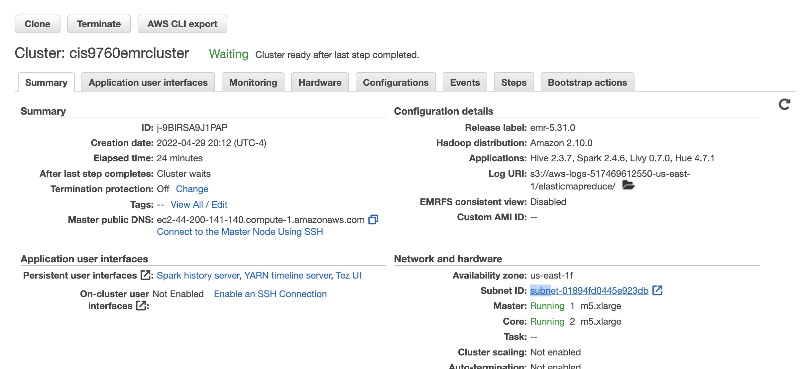
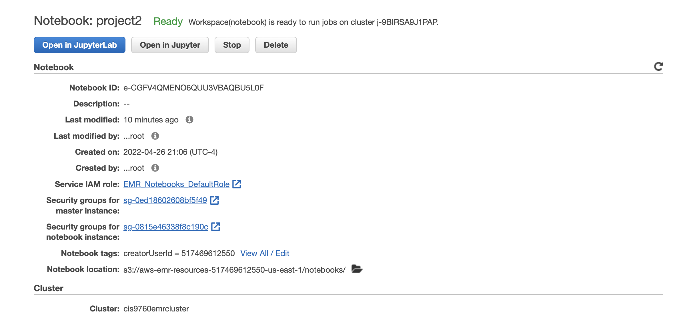

# Analysis of 10GB Yelp Reviews Data with PySpark (Scalable Analysis)

 

## Introduction

For this project, I provisioned a Spark Cluster on AWS EMR for loading and running some analysis on Yelp’s Reviews and Businesses dataset (about 10gb) from [**Kaggle**](https://www.kaggle.com/yelp-dataset/yelp-dataset#yelp_academic_dataset_user.json). I conducted my analysis via Jupyter Notebook and the expected output artifact is **Analysis.ipynb** file.

## Requiremen

Provision a Spark cluster on AWS EMR, connect it to a Jupyter Notebook and then run a series of queries (in python with DataFrame API or Spark SQL) that answer a few questions about the Yelp Data available 

## EMR cluster configuration and Notebook configuration

### Cluster Configuration

****

### Notebook Configuration

****

## Data analysis

### Part I: Installation and Initial Setup

Importing the necessary dependencies (**pandas, matplotlib, scipy and seaborn** ), loading dataset (previously uploaded into AWS S3 Bucket) as a pyspark dataframe.

### Part II:  Analyzing Categories

Building an association table mapping a single business id multiple times to each distinct category, and then running analysis to get **Top 20 Categories by Business.**

### Part III: Do Yelp Reviews Skew Negative?

Performing analysis on table users and table business (join users and business). Answer the question: **are the (written) reviews generally more pessimistic or more optimisticas compared to the overall business rating.**

### Part IV: Should the Elite be Trusted? 

Performing analysis on table users and table reviews (join users and reviews). Answer the question: **are the ratings from "elite" users close to the actual ratings of business.**

### Part V:

1. Creating a table counting the total number of reviewers for each business ID, then running analysis to explore **the correlation between  number of reviewers and business ratings.**

2. Performing analysis to get **business names having most reviews from "elite" users.**

 
